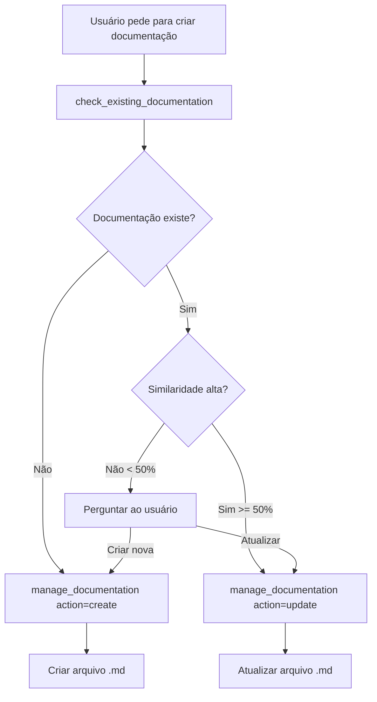

# Sistema de Gerenciamento Inteligente de Documentação

## Problema Resolvido

**Antes:** Agentes de IA criavam múltiplos arquivos `.md` para o mesmo tópico, gerando documentação duplicada e desatualizada.

**Agora:** Sistema inteligente que **AUTOMATICAMENTE DETECTA** documentação existente e **BLOQUEIA** criação de duplicatas, forçando atualização!

## ⚡ Verificação Automática (Novo!)

### Como Funciona

Quando você tenta criar documentação com `manage_documentation(action="create")` , o sistema **AUTOMATICAMENTE**:

1. 🔍 **Busca** documentos similares (título, tópicos, keywords)
2. 📊 **Calcula** score de similaridade
3. 🚫 **BLOQUEIA** se encontrar doc com similaridade ≥ 50%
4. ✅ **Sugere** usar `action="update"` no documento existente

**Você NÃO precisa mais lembrar de chamar `check_existing_documentation` primeiro!**

### Exemplo: Tentativa de Criar Duplicata

```typescript
// Agent tenta criar documentação
manage_documentation({
  action: "create",
  title: "Autenticação JWT",
  file_path: "docs/jarvis/new-auth.md",
  topics: ["authentication", "jwt"],
  keywords: ["token", "login"]
})

// 🚫 SISTEMA BLOQUEIA AUTOMATICAMENTE:
{
  "success": false,
  "action": "blocked",
  "message": "⚠️ DOCUMENTAÇÃO SIMILAR JÁ EXISTE! Bloqueado para evitar duplicação.",
  "reason": "duplicate_prevention",
  "similar_document": {
    "id": "autenticacao-jwt-backend",
    "title": "Autenticação JWT no Backend",
    "file_path": "docs/jarvis/auth-flow.md",
    "similarity_score": 145,
    "version": 3
  },
  "recommendation": "Use manage_documentation com action='update' e document_id='autenticacao-jwt-backend'"
}
```

### Workflow Correto Após Bloqueio

```typescript
// 1. Sistema bloqueou e retornou document_id
const blockedResponse = /* resposta acima */;

// 2. Use action=update com o ID fornecido
manage_documentation({
  action: "update",
  document_id: "autenticacao-jwt-backend",  // ← ID do bloqueio
  summary: "Atualizado para incluir refresh tokens",
  keywords: ["token", "login", "auth", "refresh"]
})

// 3. SUCESSO - Documento atualizado, não duplicado!
```

## 🎛️ Force Create (Casos Especiais)

Se você **realmente** precisa criar um novo documento mesmo com similaridade alta:

```typescript
manage_documentation({
  action: "create",
  title: "Autenticação OAuth2 (Diferente do JWT)",
  file_path: "docs/jarvis/oauth2-auth.md",
  topics: ["authentication", "oauth2"],
  keywords: ["oauth", "google", "login"],
  force_create: true  // ⚠️ Bypassa verificação
})

// Resposta com aviso:
{
  "success": true,
  "action": "created",
  "warning": "⚠️ force_create=true foi usado. 1 documento(s) similar(es) foram ignorados.",
  "ignored_similar_docs": [
    { "title": "Autenticação JWT no Backend", "similarity_score": 85 }
  ]
}
```

**⚠️ Use `force_create` apenas quando:**
* É realmente um tópico diferente
* Documentação existente não cobre o assunto
* Você tem certeza que não é duplicação

## 📋 Novo Workflow Simplificado

### Antes (Manual - Não Garantido)

```typescript
// ❌ Agente podia esquecer de verificar
1. check_existing_documentation(...)  // Opcional - agente pode pular
2. Ler resposta
3. Decidir manualmente
4. manage_documentation(...)
```

### Agora (Automático - Garantido!)

```typescript
// ✅ Verificação SEMPRE acontece automaticamente
manage_documentation({
  action: "create",
  // ... dados do documento
})

// Sistema automaticamente:
// - Verifica similaridade
// - Bloqueia se necessário
// - Fornece document_id para update
```

## 🔄 Fluxo Automático Detalhado

```
User: "Crie documentação sobre autenticação JWT"
  ↓
Agent: manage_documentation(action="create", title="Auth JWT", ...)
  ↓
╔══════════════════════════════════════════╗
║   VERIFICAÇÃO AUTOMÁTICA (INVISÍVEL)     ║
║                                          ║
║  1. Busca docs com título similar       ║
║  2. Calcula score (título+tópicos+kw)   ║
║  3. Encontrou: "Autenticação JWT        ║
║     no Backend" → Score: 145            ║
╚══════════════════════════════════════════╝
  ↓
Score >= 50? SIM
  ↓
🚫 BLOQUEIO AUTOMÁTICO
  ↓
Response: {
  "success": false,
  "action": "blocked",
  "similar_document": {
    "id": "autenticacao-jwt-backend",
    "file_path": "docs/jarvis/auth-flow.md"
  }
}
  ↓
Agent: manage_documentation(
  action="update",
  document_id="autenticacao-jwt-backend",
  summary="Updated..."
)
  ↓
✅ DOCUMENTO ATUALIZADO (NÃO CRIADO NOVO!)
  ↓
Result: docs/jarvis/auth-flow.md (v4)
```

## 🎯 Por Que Isso Resolve o Problema

### ❌ Problema Antigo

```
Docs antes (bagunça):
├── authentication-flow.md (v1, 2023)
├── auth-implementation.md (v1, 2024)
├── jwt-authentication.md (v1, 2024)
├── new-auth-docs.md (v1, 2025)
└── authentication-updated.md (v1, 2025)

❌ 5 arquivos sobre o mesmo tema
❌ Nenhum está completo/atualizado
❌ Impossível saber qual é o correto
❌ Agente cria novo a cada pedido
```

### ✅ Solução Nova

```
Docs agora (organizado):
└── authentication-flow.md (v8, 2026-01-04)
    ↑
    Único arquivo, sempre atualizado
    Sistema BLOQUEIA criação de novos
    Versão incrementa a cada update
    Histórico completo no JSON

✅ 1 arquivo = fonte única da verdade
✅ Sempre atualizado (versão atual)
✅ Impossível duplicar (bloqueio automático)
✅ Agente forçado a atualizar
```

## 🔒 Garantias do Sistema

1. **Impossível criar duplicata acidentalmente**
   - Verificação automática sempre roda
   - Bloqueio em similaridade ≥ 50%
   - Agent não pode "esquecer" de verificar

2. **Única fonte da verdade**
   - Só um documento por tópico
   - Versão sempre incrementada
   - Histórico rastreável no JSON

3. **Atualização forçada**
   - System fornece document_id exato
   - Agent usa action="update"
   - Arquivo existente é modificado

4. **Override consciente**
   - `force_create=true` disponível
   - Aviso explícito mostrado
   - Documentos ignorados listados

## Como Funciona

### 1. Verificação Antes de Criar

```typescript
// SEMPRE use check_existing_documentation ANTES de criar documentação
check_existing_documentation({
  title: "Autenticação JWT no Backend",
  topics: ["authentication", "jwt", "security"],
  keywords: ["token", "login", "auth"],
  context: "backend"
})
```

**Resposta quando NÃO existe:**

```json
{
  "exists": false,
  "recommendation": "Pode criar NOVO documento com segurança",
  "action": "create"
}
```

**Resposta quando JÁ existe:**

```json
{
  "exists": true,
  "recommendation": "ATUALIZAR documento existente em vez de criar novo!",
  "action": "update",
  "similar_documents": [{
    "id": "autenticacao-jwt-backend",
    "title": "Autenticação JWT no Backend",
    "file_path": "docs/jarvis/authentication-flow.md",
    "similarity_score": 95,
    "version": 3
  }]
}
```

### 2. Criar Novo Documento

```typescript
manage_documentation({
  action: "create",
  title: "Autenticação JWT no Backend",
  file_path: "docs/jarvis/authentication-flow.md",
  topics: ["authentication", "jwt", "security"],
  keywords: ["token", "login", "auth", "middleware"],
  summary: "Documentação completa sobre autenticação JWT implementada no backend",
  context: "backend",
  type: "architecture",
  related_contracts: ["IAuthService"],
  related_features: ["user-authentication"]
})
```

### 3. Atualizar Documento Existente

```typescript
manage_documentation({
  action: "update",
  document_id: "autenticacao-jwt-backend",
  summary: "Documentação atualizada incluindo refresh tokens",
  keywords: ["token", "login", "auth", "middleware", "refresh"],
  related_features: ["user-authentication", "token-refresh"]
})
```

### 4. Listar Documentação

```typescript
// Listar todos
list_documentation({})

// Filtrar por contexto
list_documentation({
  context: "backend",
  type: "architecture"
})

// Buscar por palavras-chave
list_documentation({
  keywords: ["authentication", "security"]
})
```

## Workflow Recomendado

### Para Agentes de IA (GitHub Copilot, Claude, etc.)



### Exemplo Completo

```typescript
// 1. Verificar se existe
const check = await check_existing_documentation({
  title: "Fluxo de Pagamento com Stripe",
  topics: ["payment", "stripe", "checkout"],
  keywords: ["stripe", "payment", "checkout", "webhook"],
  context: "backend"
});

// 2. Decidir ação
if (check.exists && check.action === "update") {
  // ATUALIZAR existente
  const result = await manage_documentation({
    action: "update",
    document_id: check.similar_documents[0].id,
    summary: "Atualizado para incluir suporte a PIX",
    keywords: [...check.similar_documents[0].keywords, "pix"]
  });
  
  // 3. Atualizar arquivo .md
  await replace_string_in_file({
    filePath: check.similar_documents[0].file_path,
    oldString: "## Métodos de Pagamento\n- Cartão de Crédito\n- Boleto",
    newString: "## Métodos de Pagamento\n- Cartão de Crédito\n- Boleto\n- PIX"
  });
  
} else {
  // CRIAR NOVO
  const result = await manage_documentation({
    action: "create",
    title: "Fluxo de Pagamento com Stripe",
    file_path: "docs/jarvis/payment-flow.md",
    topics: ["payment", "stripe", "checkout"],
    keywords: ["stripe", "payment", "checkout", "webhook"],
    summary: "Documentação completa do fluxo de pagamento",
    context: "backend",
    type: "business-flow"
  });
  
  // 4. Criar arquivo .md
  await create_file({
    filePath: result.document.file_path,
    content: `# ${result.document.title}\n\n...conteúdo...`
  });
}
```

## Benefícios

✅ **Sem Duplicação**: Sistema detecta documentação similar automaticamente
✅ **Sempre Atualizado**: Documentos são atualizados em vez de replicados  
✅ **Versionamento**: Cada atualização incrementa a versão
✅ **Rastreabilidade**: Sabe exatamente qual é a documentação atual
✅ **Busca Inteligente**: Encontra documentos por título, tópicos e palavras-chave
✅ **Organização**: Filtros por contexto, tipo e keywords

## Tipos de Documentação

### Contextos

* `backend` - Documentação do backend
* `frontend` - Documentação do frontend
* `infrastructure` - Documentação de infraestrutura
* `shared` - Documentação compartilhada
* `general` - Documentação geral

### Tipos

* `architecture` - Decisões arquiteturais
* `api` - Documentação de APIs
* `guide` - Guias e tutoriais
* `troubleshooting` - Solução de problemas
* `setup` - Configuração inicial
* `business-flow` - Fluxos de negócio
* `other` - Outros tipos

## Metadados Rastreados

Cada documento registrado contém:

```typescript
{
  id: string;              // ID único gerado
  title: string;           // Título do documento
  filePath: string;        // Caminho do arquivo .md
  topics: string[];        // Tópicos principais
  keywords: string[];      // Palavras-chave para busca
  summary: string;         // Resumo do conteúdo
  context: string;         // Contexto (backend/frontend/etc)
  type: string;            // Tipo de documentação
  relatedContracts: [];    // Contratos mencionados
  relatedFeatures: [];     // Features mencionadas
  version: number;         // Número da versão
  createdAt: Date;         // Data de criação
  lastUpdated: Date;       // Última atualização
}
```

## Integração com Features e Contratos

Os documentos podem ser vinculados a:
* **Contratos**: Interfaces e contratos mencionados
* **Features**: Features implementadas no projeto

Isso permite consultas cruzadas:

```typescript
// Buscar todas as docs relacionadas a uma feature
const featureContext = await get_feature_context({ 
  feature_id: "user-authentication" 
});

// As docs relacionadas estarão linkadas
const relatedDocs = list_documentation({ 
  keywords: ["authentication"] 
});
```

## Migração de Documentação Existente

Para registrar documentação já existente:

```typescript
// Para cada .md no projeto
manage_documentation({
  action: "create",
  title: "Extraído do arquivo",
  file_path: "caminho/do/arquivo.md",
  topics: ["extraídos", "do", "conteúdo"],
  keywords: ["palavras", "chave"],
  summary: "Resumo do documento",
  context: "apropriado",
  type: "apropriado"
});
```

## Boas Práticas

1. **SEMPRE verifique primeiro**: Use `check_existing_documentation` antes de criar
2. **Metadados ricos**: Forneça tópicos e keywords relevantes para melhor busca
3. **Sumários claros**: Escreva resumos que facilitem identificar o conteúdo
4. **Contexto correto**: Classifique corretamente (backend/frontend/etc)
5. **Tipo apropriado**: Use o tipo que melhor descreve o documento
6. **Links cruzados**: Vincule contratos e features relacionadas

## Comandos Úteis

```bash
# Ver todos os documentos do projeto atual
list_documentation

# Ver documentação de backend sobre APIs
list_documentation({ context: "backend", type: "api" })

# Buscar docs sobre autenticação
list_documentation({ keywords: ["authentication", "auth"] })

# Verificar se já existe doc sobre tema
check_existing_documentation({ 
  title: "Novo Tema",
  keywords: ["palavras", "chave"]
})
```

## Resultado Esperado

**Antes do sistema:**

```
docs/
  authentication-flow.md (desatualizado)
  auth-implementation.md (duplicado)
  how-jwt-works.md (desatualizado)
  new-auth-docs-2025.md (qual é o atual?)
  authentication-update.md (???)
```

**Depois do sistema:**

```
docs/
  authentication-flow.md (v5 - atualizado, único, completo)
  
knowledge/jarvis/documentation.json
  → Registra: título, versão, keywords, última atualização
  → Agentes SEMPRE consultam antes de criar
  → SEMPRE atualizam o existente
```

## Persistência

Todos os metadados são salvos em:

```
knowledge/<projeto>/documentation.json
```

Formato:

```json
{
  "documentation": {
    "autenticacao-jwt-backend": {
      "id": "autenticacao-jwt-backend",
      "title": "Autenticação JWT no Backend",
      "filePath": "docs/jarvis/authentication-flow.md",
      "version": 5,
      "lastUpdated": "2026-01-04T12:30:00.000Z"
    }
  },
  "lastUpdated": "2026-01-04T12:30:00.000Z",
  "version": "1.0.0"
}
```

---

**✨ Resultado Final: Documentação sempre atualizada, organizada e consultável!**
