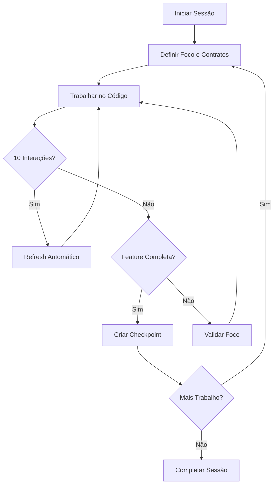

# 🎯 Sistema de Manutenção de Foco em Sessões

## Visão Geral

O **Sistema de Manutenção de Foco** garante que conversas longas com AI não percam o rumo, mantendo sempre ativas as premissas, contratos e guidelines do projeto.

## Problema Resolvido

Durante conversas longas com AI:
* ❌ **Antes**: Guidelines eram esquecidas após muitas interações
* ❌ **Antes**: Contratos críticos não eram validados continuamente
* ❌ **Antes**: Conversa divergia do objetivo original
* ❌ **Antes**: Era necessário reafirmar premissas constantemente

Com o sistema de sessões:
* ✅ **Agora**: Auto-refresh de contexto a cada 10 interações ou 30 minutos
* ✅ **Agora**: Validação automática contra contratos e guidelines
* ✅ **Agora**: Checkpoints regulares mantêm foco e progresso
* ✅ **Agora**: Violações são detectadas e alertadas imediatamente

---

## Componentes do Sistema

### 1. SessionState

Mantém estado completo da sessão:
* Projeto e contexto (backend/frontend/infra)
* Contratos e features ativos
* Foco atual da conversa
* Contador de interações (turnos)
* Checkpoints de progresso
* Violações detectadas

### 2. SessionManager

Gerencia ciclo de vida das sessões:
* Criar, pausar, retomar, completar sessões
* Adicionar checkpoints e violações
* Verificar necessidade de refresh de contexto
* Limpeza automática de sessões antigas

### 3. Validação Contínua

Valida cada ação contra:
* **Contratos**: Interfaces críticas que devem ser respeitadas
* **Guidelines**: Regras globais (SOLID, Clean Architecture, etc)
* **Foco da Sessão**: Verifica alinhamento com objetivo

---

## Uso Prático

### 1️⃣ Iniciar Sessão Focada

```typescript
// Prompt MCP
@project-docs #coding-session backend

// Ou manualmente via tool
start_session({
  context: "backend",
  current_focus: "Implementar autenticação JWT",
  active_contracts: ["IAuthService", "IUserRepository"],
  focus_reminders: [
    "Sempre validar tokens antes de acessar recursos protegidos",
    "Usar bcrypt para hash de senhas"
  ]
})
```

**Resultado**: Sessão criada com instruções de manutenção de foco automáticas.

---

### 2️⃣ Validar Alinhamento (Automático)

Durante a conversa, antes de implementar algo crítico:

```typescript
validate_conversation_focus({
  proposed_code: "código_proposto",
  proposed_action: "Adicionar endpoint de login"
})
```

**Resultado**:
* ✅ Validado contra contratos ativos
* ✅ Verificado alinhamento com foco
* ⚠️ Alerta se detectar violação
* 🔄 Sugere refresh se necessário

---

### 3️⃣ Refresh Automático de Contexto

**Automático**: A cada 10 interações ou 30 minutos, o sistema sugere:

```typescript
refresh_session_context()
```

**Resultado**:
* 🔄 Recarrega guidelines globais
* 📝 Atualiza lista de contratos
* 🎯 Reforça padrões do projeto
* ⏰ Reseta timer de refresh

---

### 4️⃣ Criar Checkpoints

Ao completar uma etapa:

```typescript
create_checkpoint({
  summary: "Autenticação JWT implementada com middleware de validação",
  next_focus: "Implementar refresh tokens e revogação",
  files_modified: [
    "src/auth/jwt.service.ts",
    "src/middleware/auth.middleware.ts"
  ]
})
```

**Resultado**:
* 🏁 Checkpoint salvo com timestamp
* 🎯 Foco da sessão atualizado
* 📋 Histórico de progresso mantido

---

### 5️⃣ Verificar Estado da Sessão

```typescript
get_session_state()
```

**Retorna**:
* 📊 Foco atual e turnos realizados
* 📝 Contratos e features ativas
* ⚠️ Violações pendentes
* 🏁 Último checkpoint
* 🔄 Se precisa de refresh

---

### 6️⃣ Retomar Sessão Anterior

```typescript
@project-docs #session-resume session-123456
```

**Resultado**:
* 📋 Carrega todo histórico da sessão
* 🏁 Mostra checkpoints recentes
* ⚠️ Lista violações pendentes
* 🎯 Reestabelece foco e contexto

---

### 7️⃣ Finalizar Sessão

```typescript
complete_session({ session_id: "session-123456" })
```

**Resultado**:
* ✅ Sessão marcada como completa
* 📊 Resumo de métricas (duração, turnos, violações)
* 🗄️ Mantida para consulta futura

---

## Workflow Recomendado



---

## Regras de Auto-Refresh

| Trigger | Condição | Ação |
|---------|----------|------|
| **Turnos** | A cada 10 interações | `refresh_session_context` sugerido |
| **Tempo** | A cada 30 minutos | `refresh_session_context` sugerido |
| **Violação** | Contrato violado | Alerta imediato + sugestão de fix |
| **Divergência** | Ação fora do foco | Warning + sugestão de realinhamento |

---

## Tipos de Violações

### 1. Contract Violation (Error)

```json
{
  "type": "contract",
  "severity": "error",
  "description": "Contrato crítico 'IAuthService' não está sendo respeitado",
  "suggestedFix": "Verifique o contrato e ajuste a implementação"
}
```

### 2. Guideline Violation (Error)

```json
{
  "type": "guideline",
  "severity": "error",
  "description": "Guideline violada: Never use console.log in production",
  "suggestedFix": "Use logging library configurável"
}
```

### 3. Context Divergence (Warning)

```json
{
  "type": "context",
  "severity": "warning",
  "description": "Ação proposta pode não estar alinhada com o foco: 'Implementar JWT'",
  "suggestedFix": "Verifique se está trabalhando no escopo correto"
}
```

---

## Métricas da Sessão

Ao finalizar, você obtém:

```json
{
  "duration": 45,              // minutos
  "turnCount": 23,             // interações
  "checkpointsCount": 3,       // etapas completadas
  "resolvedViolations": 2,     // violações corrigidas
  "totalViolations": 2         // total detectado
}
```

---

## Persistência

Todas as sessões são salvas em:

```
{projectRoot}/.project-docs-mcp/sessions.json
```

Isso permite:
* ✅ Retomar sessões entre diferentes chats
* ✅ Versionar histórico no git
* ✅ Consultar métricas de projetos
* ✅ Aprender padrões de trabalho

---

## Comandos Rápidos

| Comando | O que faz |
|---------|-----------|
| `@project-docs #coding-session backend` | Inicia sessão focada |
| `@project-docs #session-resume session-id` | Retoma sessão anterior |
| `validate_conversation_focus` | Valida alinhamento atual |
| `refresh_session_context` | Recarrega guidelines |
| `create_checkpoint` | Salva progresso |
| `get_session_state` | Verifica estado |
| `list_active_sessions` | Lista sessões ativas |
| `complete_session` | Finaliza sessão |

---

## Benefícios

### Para Desenvolvedores

* ✅ Menos repetição de contexto
* ✅ Código mais consistente com padrões
* ✅ Violações detectadas antes de commit
* ✅ Histórico de decisões preservado

### Para AI Agents

* ✅ Sempre ciente dos contratos críticos
* ✅ Validação automática de implementações
* ✅ Foco mantido durante toda conversa
* ✅ Lembretes periódicos de guidelines

### Para Times

* ✅ Onboarding mais rápido
* ✅ Padrões respeitados consistentemente
* ✅ Decisões documentadas automaticamente
* ✅ Métricas de desenvolvimento rastreáveis

---

## Exemplo Completo

```typescript
// 1. Iniciar sessão
start_session({
  context: "backend",
  current_focus: "Implementar sistema de pagamentos",
  active_contracts: ["IPaymentGateway", "ITransactionRepository"],
  focus_reminders: ["Sempre validar valores", "Usar transações ACID"]
})

// 2. Trabalhar... (AI implementa código)

// 3. Validar (automático a cada interação crítica)
validate_conversation_focus({
  proposed_code: "class StripePaymentGateway implements IPaymentGateway {...}",
})
// Resultado: ✅ Validado contra IPaymentGateway

// 4. Checkpoint após completar feature
create_checkpoint({
  summary: "Gateway Stripe implementado com retry logic",
  next_focus: "Implementar webhook de confirmação de pagamento",
  files_modified: ["src/payment/stripe.gateway.ts"]
})

// 5. Continuar trabalhando... (10 interações depois)
// Sistema sugere automaticamente: refresh_session_context()

// 6. Finalizar ao terminar
complete_session({ session_id: "session-xyz" })
// Resultado: ✅ Sessão completa - 15 min, 12 interações, 2 checkpoints, 0 violações
```

---

## Conclusão

O Sistema de Manutenção de Foco transforma conversas com AI em **sessões estruturadas e rastreáveis**, garantindo que:

* 🎯 Foco nunca é perdido
* 📝 Contratos sempre respeitados
* ✅ Guidelines sempre aplicadas
* 📊 Progresso sempre documentado

**Use em toda sessão de desenvolvimento para máxima produtividade!**
